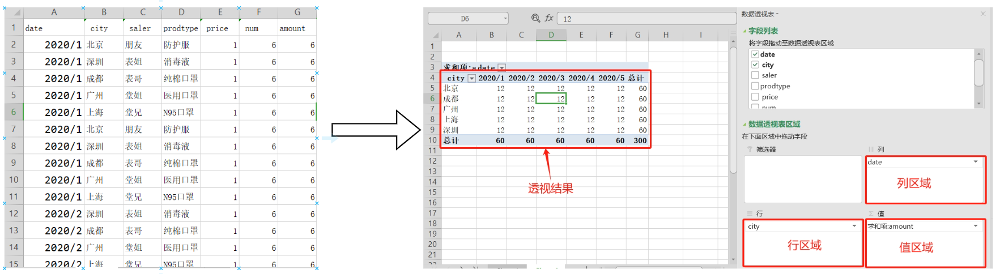

# 📚简介

Java Pivot 是一个轻量级、高效的类似数据透视表的Java工具库，用于类似数据透视表的数据加工，无需依赖其他组件，是一款专为交叉报表而生的数据处理工具。



## 功能清单

* **数据汇总**：数据透视表可以自动对数据进行求和、平均、计数、最大值、最小值等汇总操作。
* **多维度分析**：用户可以按照不同的维度（如时间、地点、产品等）来组织数据，从而从多个角度分析数据。

# 📦安装

## 🍊Maven

在项目的pom.xml的dependencies中加入以下内容:

```xml
<dependency>
    <groupId>com.pivothy</groupId>
    <artifactId>pivothy</artifactId>
    <version>1.2.1</version>
</dependency>

```

## 🍐Gradle

```
implementation 'com.pivothy:pivothy:1.2.1'
```

## 📥下载jar

点击以下链接，下载`pivothy-X.X.X.jar`即可：

* [Maven中央库](https://repo1.maven.org/maven2/com/pivothy/pivothy/1.2.1/)

# 📝文档

🔥[使用指南](docs/pivothy.md)

# 交流

## 联系我

* **Email**

（PS：邮件查看不及时，可能无法回复）

[haoyan665@163.com](mailto:haoyan665@163.com)

* **Wechat**


* 加入学习交流群。


# 💳支持

如果你觉得不错，可以捐赠请维护者吃包辣条\~，在此表示感谢^\_^


