# pivothy使用指南

## 快速入门

[源始数据](docs.json)

**示例表格（只展示部分数据）**


| date   | amount | city | price | num | saler | prodtype |
| ------ | ------ | ---- | ----- | --- | ----- | -------- |
| 2020/1 | 6      | 北京 | 1     | 6   | 朋友  | 防护服   |
| 2020/1 | 6      | 深圳 | 1     | 6   | 表姐  | 消毒液   |
| 2020/1 | 6      | 成都 | 1     | 6   | 表哥  | 纯棉口罩 |
| 2020/1 | 6      | 广州 | 1     | 6   | 堂姐  | 医用口罩 |
| 2020/1 | 6      | 上海 | 1     | 6   | 堂兄  | N95口罩  |
| 2020/1 | 6      | 北京 | 1     | 6   | 朋友  | 防护服   |
| 2020/1 | 6      | 深圳 | 1     | 6   | 表姐  | 消毒液   |
| 2020/1 | 6      | 成都 | 1     | 6   | 表哥  | 纯棉口罩 |
| 2020/1 | 6      | 广州 | 1     | 6   | 堂姐  | 医用口罩 |
| 2020/1 | 6      | 上海 | 1     | 6   | 堂兄  | N95口罩  |
| 2020/1 | 6      | 深圳 | 1     | 6   | 表姐  | 消毒液   |

**示例数据：**

```json
{"date":"2020/1","amount":6,"city":"北京","num":6,"saler":"朋友","price":1,"prodtype":"防护服"}
```

**需求示例：**

date列数据要求横向扩展，city（城市）列数据要求纵向扩展，amount(金额)为行列交叉的值。

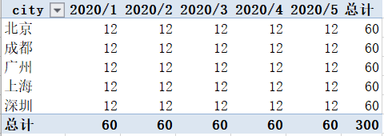

**示例代码（java)：**

```java
List<Map<String, Object>> list = MockDataSource.getList();//获取上述源始数据
Pivot pivot= new Pivot(list);//构建透视对象
privotForge.addRowField("city", "城市");//设置行区域字段(用于纵向扩展）
privotForge.addColField("date","日期");//设置列区域字段（用于横向扩展)
privotForge.addValField("num");//设置值区域字段（交叉数值）
privotForge.exec();//进行数据透视处理
List<List<Map<String, Object>>> tableMap = privotForge.outOfTableMap();//获取透视结果数据
//上述结果对象Map<String, Object>的属性示例：
//value: 单元格的实际值。
//format: 单元格的格式化后的值。
//posX:单元格所在结果表格的X轴位置。从0开始。
//posY:单元格所在结果表格的Y轴位置。从0开始。
//spancol:单元格所在结果表格的跨列数。
//spanrow:单元格所在结果表格的跨行数。
//dataType:单元格的数据类型，NORMAL("普通"), SUBTOTAL("汇总"), TOTAL("总计"),MUTIL("数值"),TITLE("标题")
List<List<String>> table = privotForge.outOfTable();//获取透视结果数据
//outOfTable方法返回的结果不存在跨行或跨列的情况，输出直接为一个表格。
```

结果数据示例：

示例在线展示地址：https://www.jyshare.com/front-end/61/

页面样式

```html
charset "utf-8";
.tabtop13 {
	margin-top: 13px;
}
.tabtop13 td{
	background-color:#ffffff;
	height:25px;
	line-height:150%;
}
.font-center{ text-align:center}
.btbg{background:#e9faff !important;}
.titfont {

	font-family: 微软雅黑;
	font-size: 16px;
	font-weight: bold;
	color: #255e95;
	background: url(../images/ico3.gif) no-repeat 15px center;
	background-color:#e9faff;
}
```

outOfTableMap方法返回结果前端展示：

```java
public void mapHtml(List<List<Map<String,Object>>> list) {
		StringBuilder build = new StringBuilder();
		build.append("<table width=\"100%\" border=\"0\" cellspacing=\"1\" cellpadding=\"4\" bgcolor=\"#cccccc\" class=\"tabtop13\" align=\"center\">");
		for(List<Map<String,Object>> row:list) {
			build.append("<tr>");
			boolean isTitle=false;
			for(Map<String,Object> cell:row) {
				String dataType=StrUtil.getStr(cell, "dataType");
				if(!isTitle && "TITLE".equals(dataType)) {//按第一个字段的类型判断即可
					isTitle = true;
				}
				build.append("<td");
				int spancol = StrUtil.getInt(cell, "spancol");
				if(spancol>1) {
					build.append(" colspan=\""+spancol+"\"");
				}
				int spanrow = StrUtil.getInt(cell, "spanrow");
				if(spanrow>1) {
					build.append(" rowspan=\""+spanrow+"\"");
				}
				if(isTitle) {
					build.append(" class=\"btbg font-center titfont\"");
				}
				build.append(">");
				build.append(StrUtil.getStr(cell, "format"));
				build.append("</td>");
			}
			build.append("</tr>");
			isTitle = false;
		}
		build.append("</table>");
		System.out.println(build.toString());
	}
```

在线展示效果：


| 城市 | 2020/1 | 2020/2 | 2020/3 | 2020/4 | 2020/5 | 总计  |
| ---- | ------ | ------ | ------ | ------ | ------ | ----- |
| 北京 | 12.0   | 12.0   | 12.0   | 12.0   | 12.0   | 60.0  |
| 深圳 | 12.0   | 12.0   | 12.0   | 12.0   | 12.0   | 60.0  |
| 成都 | 12.0   | 12.0   | 12.0   | 12.0   | 12.0   | 60.0  |
| 广州 | 12.0   | 12.0   | 12.0   | 12.0   | 12.0   | 60.0  |
| 上海 | 12.0   | 12.0   | 12.0   | 12.0   | 12.0   | 60.0  |
| 总计 | 60.0   | 60.0   | 60.0   | 60.0   | 60.0   | 300.0 |

outOfTable方法返回结果前端展示方法：

```java
public void tableHtml(List<List<String>> datas) {
		StringBuilder build = new StringBuilder();
		build.append("<table width=\"100%\" border=\"0\" cellspacing=\"1\" cellpadding=\"4\" bgcolor=\"#cccccc\" class=\"tabtop13\" align=\"center\">");
		for(List<String> row:datas) {
			build.append("<tr>");
			for(String cell:row) {
				build.append("<td>");
				build.append(cell);
				build.append("</td>");
			}
			build.append("</tr>");
		}
		build.append("</table>");
		System.out.println(build.toString());
	}
```

**在线展示效果：**


| 城市 | 2020/1 | 2020/2 | 2020/3 | 2020/4 | 2020/5 | 总计  |
| ---- | ------ | ------ | ------ | ------ | ------ | ----- |
| 北京 | 12.0   | 12.0   | 12.0   | 12.0   | 12.0   | 60.0  |
| 深圳 | 12.0   | 12.0   | 12.0   | 12.0   | 12.0   | 60.0  |
| 成都 | 12.0   | 12.0   | 12.0   | 12.0   | 12.0   | 60.0  |
| 广州 | 12.0   | 12.0   | 12.0   | 12.0   | 12.0   | 60.0  |
| 上海 | 12.0   | 12.0   | 12.0   | 12.0   | 12.0   | 60.0  |
| 总计 | 60.0   | 60.0   | 60.0   | 60.0   | 60.0   | 300.0 |

## 2行1列1值

**需求示例**

city（城市）和prodtype(商品类型）列要求纵向扩展，date（日期）列要求横向扩展，amount（金额）列为交叉数值。

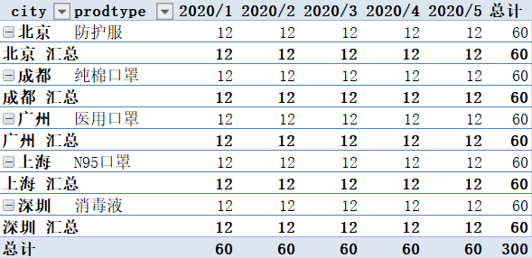

示例代码：

```java
List<Map<String, Object>> list = MockDataSource.getList();//获取上述源始数据
Pivot pivot= new Pivot(list);//构建透视对象
privotForge.addRowField("city", "城市");//设置行区域字段(用于纵向扩展）
privotForge.addRowField("prodtype", "商品类型");//设置行区域字段(用于纵向扩展）
privotForge.addColField("date","日期");//设置列区域字段（用于横向扩展)
privotForge.addValField("amount");//设置值区域字段（用于显示数值）
privotForge.exec();//进行数据透视处理
List<List<Map<String, Object>>> tableMap = privotForge.outOfTableMap();//获取透视结果数据
List<List<String>> table = privotForge.outOfTable();//获取透视结果数据
```

outOfTableMap方法返回结果前端展示：

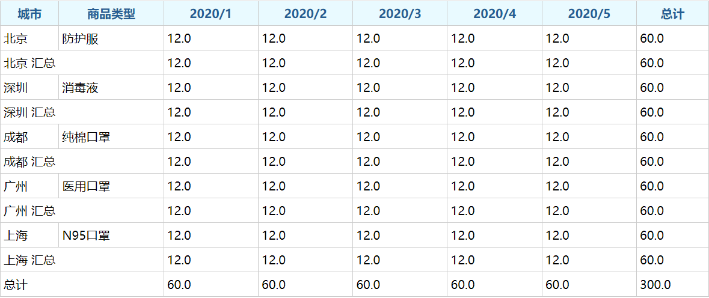

outOfTable方法返回结果:


| 城市      | 商品类型 | 2020/1 | 2020/2 | 2020/3 | 2020/4 | 2020/5 | 总计  |
| --------- | -------- | ------ | ------ | ------ | ------ | ------ | ----- |
| 北京      | 防护服   | 12.0   | 12.0   | 12.0   | 12.0   | 12.0   | 60.0  |
| 北京 汇总 |          | 12.0   | 12.0   | 12.0   | 12.0   | 12.0   | 60.0  |
| 深圳      | 消毒液   | 12.0   | 12.0   | 12.0   | 12.0   | 12.0   | 60.0  |
| 深圳 汇总 |          | 12.0   | 12.0   | 12.0   | 12.0   | 12.0   | 60.0  |
| 成都      | 纯棉口罩 | 12.0   | 12.0   | 12.0   | 12.0   | 12.0   | 60.0  |
| 成都 汇总 |          | 12.0   | 12.0   | 12.0   | 12.0   | 12.0   | 60.0  |
| 广州      | 医用口罩 | 12.0   | 12.0   | 12.0   | 12.0   | 12.0   | 60.0  |
| 广州 汇总 |          | 12.0   | 12.0   | 12.0   | 12.0   | 12.0   | 60.0  |
| 上海      | N95口罩  | 12.0   | 12.0   | 12.0   | 12.0   | 12.0   | 60.0  |
| 上海 汇总 |          | 12.0   | 12.0   | 12.0   | 12.0   | 12.0   | 60.0  |
| 总计      |          | 60.0   | 60.0   | 60.0   | 60.0   | 60.0   | 300.0 |

## 1行2列1值

**需求示例**

city（城市）列要求纵向扩展，date（日期）列和prodtype(商品类型）列要求横向扩展，amount（金额）列为交叉数值。

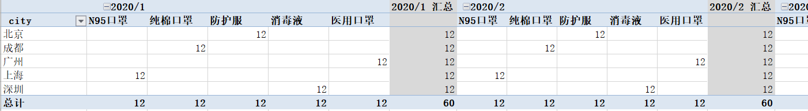

示例代码：

```java
List<Map<String, Object>> list = MockDataSource.getList();//获取上述源始数据
Pivot pivot= new Pivot(list);//构建透视对象
privotForge.addRowField("city", "城市");//设置行区域字段(用于纵向扩展）
privotForge.addColField("date","日期");//设置列区域字段（用于横向扩展)
privotForge.addColField("prodtype", "商品类型");//设置行区域字段(用于纵向扩展）
privotForge.addValField("amount");//设置值区域字段（用于显示数值）
privotForge.exec();//进行数据透视处理
List<List<Map<String, Object>>> tableMap = privotForge.outOfTableMap();//获取透视结果数据
List<List<String>> table = privotForge.outOfTable();//获取透视结果数据
```

outOfTableMap方法返回结果前端展示：

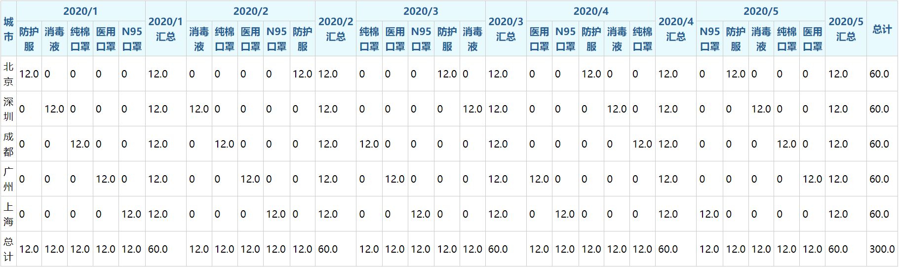

outOfTable方法返回结果:


| 城市 | 2020/1 |        |          |          |         | 2020/1 汇总 | 2020/2 |          |          |         |        | 2020/2 汇总 | 2020/3   |          |         |        |        | 2020/3 汇总 | 2020/4   |         |        |        |          | 2020/4 汇总 | 2020/5  |        |        |          |          | 2020/5 汇总 | 总计  |
| ---- | ------ | ------ | -------- | -------- | ------- | ----------- | ------ | -------- | -------- | ------- | ------ | ----------- | -------- | -------- | ------- | ------ | ------ | ----------- | -------- | ------- | ------ | ------ | -------- | ----------- | ------- | ------ | ------ | -------- | -------- | ----------- | ----- |
|      | 防护服 | 消毒液 | 纯棉口罩 | 医用口罩 | N95口罩 |             | 消毒液 | 纯棉口罩 | 医用口罩 | N95口罩 | 防护服 |             | 纯棉口罩 | 医用口罩 | N95口罩 | 防护服 | 消毒液 |             | 医用口罩 | N95口罩 | 防护服 | 消毒液 | 纯棉口罩 |             | N95口罩 | 防护服 | 消毒液 | 纯棉口罩 | 医用口罩 |             |       |
| 北京 | 12.0   | 0      | 0        | 0        | 0       | 12.0        | 0      | 0        | 0        | 0       | 12.0   | 12.0        | 0        | 0        | 0       | 12.0   | 0      | 12.0        | 0        | 0       | 12.0   | 0      | 0        | 12.0        | 0       | 12.0   | 0      | 0        | 0        | 12.0        | 60.0  |
| 深圳 | 0      | 12.0   | 0        | 0        | 0       | 12.0        | 12.0   | 0        | 0        | 0       | 0      | 12.0        | 0        | 0        | 0       | 0      | 12.0   | 12.0        | 0        | 0       | 0      | 12.0   | 0        | 12.0        | 0       | 0      | 12.0   | 0        | 0        | 12.0        | 60.0  |
| 成都 | 0      | 0      | 12.0     | 0        | 0       | 12.0        | 0      | 12.0     | 0        | 0       | 0      | 12.0        | 12.0     | 0        | 0       | 0      | 0      | 12.0        | 0        | 0       | 0      | 0      | 12.0     | 12.0        | 0       | 0      | 0      | 12.0     | 0        | 12.0        | 60.0  |
| 广州 | 0      | 0      | 0        | 12.0     | 0       | 12.0        | 0      | 0        | 12.0     | 0       | 0      | 12.0        | 0        | 12.0     | 0       | 0      | 0      | 12.0        | 12.0     | 0       | 0      | 0      | 0        | 12.0        | 0       | 0      | 0      | 0        | 12.0     | 12.0        | 60.0  |
| 上海 | 0      | 0      | 0        | 0        | 12.0    | 12.0        | 0      | 0        | 0        | 12.0    | 0      | 12.0        | 0        | 0        | 12.0    | 0      | 0      | 12.0        | 0        | 12.0    | 0      | 0      | 0        | 12.0        | 12.0    | 0      | 0      | 0        | 0        | 12.0        | 60.0  |
| 总计 | 12.0   | 12.0   | 12.0     | 12.0     | 12.0    | 60.0        | 12.0   | 12.0     | 12.0     | 12.0    | 12.0   | 60.0        | 12.0     | 12.0     | 12.0    | 12.0   | 12.0   | 60.0        | 12.0     | 12.0    | 12.0   | 12.0   | 12.0     | 60.0        | 12.0    | 12.0   | 12.0   | 12.0     | 12.0     | 60.0        | 300.0 |

## 1行1列2值

**需求示例：**

date列数据要求横向扩展，city（城市）列数据要求纵向扩展，num(数量）和 amount(金额)为行列交叉的值。

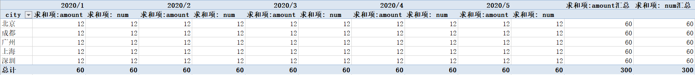

示例代码：

```java
List<Map<String, Object>> list = MockDataSource.getList();//获取上述源始数据
Pivot pivot= new Pivot(list);//构建透视对象
privotForge.addRowField("city", "城市");//设置行区域字段(用于纵向扩展）
privotForge.addColField("date","日期");//设置列区域字段（用于横向扩展)
privotForge.addValField("num","数量");//设置值区域字段（用于显示数值）
privotForge.addValField("amount","金额");//设置值区域字段（用于显示数值）
privotForge.exec();//进行数据透视处理
List<List<Map<String, Object>>> tableMap = privotForge.outOfTableMap();//获取透视结果数据
List<List<String>> table = privotForge.outOfTable();//获取透视结果数据
```

outOfTableMap方法返回结果前端展示：

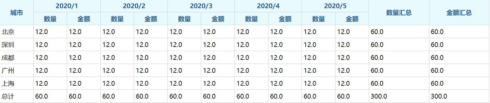

## 1行1列2值-行区域

需求示例：

date列数据要求横向扩展，city（城市）列数据要求纵向扩展，num(数量）和 amount(金额)为行列交叉的值，其中数量和金额纵向显示（在行区域显示）。


| 行标签   | 值   | 2020/1 | 2020/2 | 2020/3 | 2020/4 | 2020/5 | 总计 |
| -------- | ---- | ------ | ------ | ------ | ------ | ------ | ---- |
| 北京     | 数量 | 12     | 12     | 12     | 12     | 12     | 60   |
|          | 金额 | 12     | 12     | 12     | 12     | 12     | 60   |
| 成都     | 数量 | 12     | 12     | 12     | 12     | 12     | 60   |
|          | 金额 | 12     | 12     | 12     | 12     | 12     | 60   |
| 广州     | 数量 | 12     | 12     | 12     | 12     | 12     | 60   |
|          | 金额 | 12     | 12     | 12     | 12     | 12     | 60   |
| 上海     | 数量 | 12     | 12     | 12     | 12     | 12     | 60   |
|          | 金额 | 12     | 12     | 12     | 12     | 12     | 60   |
| 深圳     | 数量 | 12     | 12     | 12     | 12     | 12     | 60   |
|          | 金额 | 12     | 12     | 12     | 12     | 12     | 60   |
| 数量汇总 |      | 60     | 60     | 60     | 60     | 60     | 300  |
| 金额汇总 |      | 60     | 60     | 60     | 60     | 60     | 300  |

代码示例：

```java
List<Map<String, Object>> list = MockDataSource.getList();//获取上述源始数据
Pivot pivot= new Pivot(list);//构建透视对象
privotForge.addRowField("city", "城市");//设置行区域字段(用于纵向扩展）
privotForge.addColField("date","日期");//设置列区域字段（用于横向扩展)
privotForge.addValField("num","数量");//设置值区域字段（用于显示数值）
privotForge.addValField("amount","金额");//设置值区域字段（用于显示数值）
privotForge.setTotalFieldOfColPanel(false);//设置多值字段展示所在区域 true:列区域(默认),false:行区域
privotForge.exec();//进行数据透视处理
List<List<Map<String, Object>>> tableMap = privotForge.outOfTableMap();//获取透视结果数据
```

outOfTableMap方法返回结果前端展示：

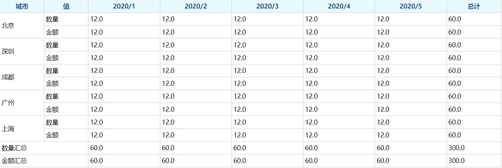

## 大纲布局

示例需求：

city（城市）列和date列数据要求纵向扩展，city（城市）的布局要求大纲，prodtype（商品类型）为横向扩展， amount(金额)为行列交叉的值。

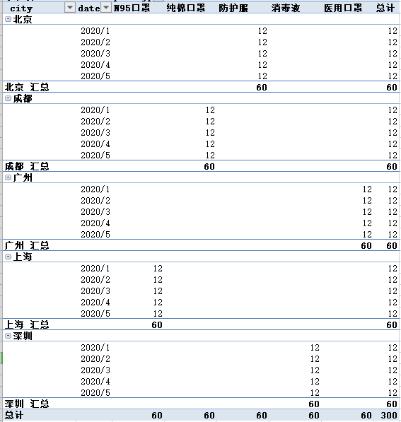

示例代码：

```java
List<Map<String, Object>> list = MockDataSource.getList();//获取上述源始数据
Pivot pivot= new Pivot(list);//构建透视对象
privotForge.addRowField("city", "城市",Layout.TREE);//设置行区域字段(用于纵向扩展），且为大纲布局
privotForge.addRowField("date","日期");//设置行区域字段（用于纵向扩展)
privotForge.addColField("prodtype","商品类型");//设置列区域字段（用于横向扩展）
privotForge.addValField("amount","金额");//设置值区域字段（用于显示数值）
privotForge.exec();//进行数据透视处理
List<List<Map<String, Object>>> tableMap = privotForge.outOfTableMap();//获取透视结果数据
List<List<String>> table = privotForge.outOfTable();//获取透视结果数据
```

## 大纲布局-汇总在顶端

示例需求：

city（城市）列和date列数据要求纵向扩展，city（城市）的布局要求大纲，城市的汇总小计在顶部显示，prodtype（商品类型）为横向扩展， amount(金额)为行列交叉的值。

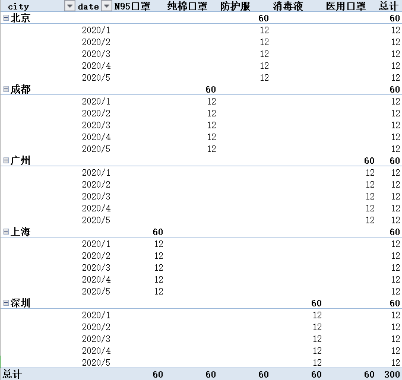

示例代码：

```java
List<Map<String, Object>> list = MockDataSource.getList();//获取上述源始数据
Pivot pivot= new Pivot(list);//构建透视对象
privotForge.addRowField("city", "城市",Layout.TREE);//设置行区域字段(用于纵向扩展），且为大纲布局
privotForge.addRowField("date","日期");//设置行区域字段（用于纵向扩展)
privotForge.addColField("prodtype","商品类型");//设置列区域字段（用于横向扩展）
privotForge.addValField("amount","金额");//设置值区域字段（用于显示数值）
privotForge.setLayoutOfToptotal("city", true);//设置城市汇总在顶端。
privotForge.exec();//进行数据透视处理
List<List<Map<String, Object>>> tableMap = privotForge.outOfTableMap();//获取透视结果数据
List<List<String>> table = privotForge.outOfTable();//获取透视结果数据
```

## 大纲布局-压缩显示

city（城市）列和date列数据要求纵向扩展，city（城市）的布局要求大纲，城市的汇总小计在顶部显示，prodtype（商品类型）为横向扩展， amount(金额)为行列交叉的值。

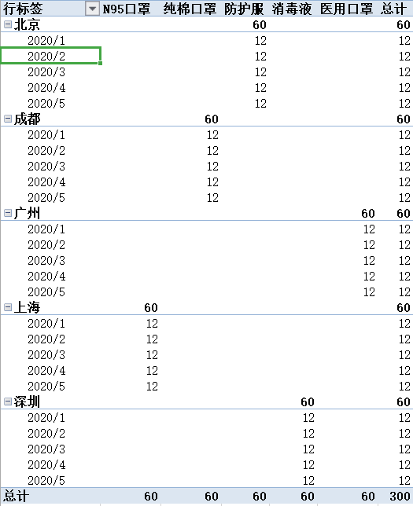

示例代码：

```java
List<Map<String, Object>> list = MockDataSource.getList();//获取上述源始数据
Pivot pivot= new Pivot(list);//构建透视对象
privotForge.addRowField("city", "城市",Layout.TREE);//设置行区域字段(用于纵向扩展），且为大纲布局
privotForge.addRowField("date","日期");//设置行区域字段（用于纵向扩展)
privotForge.addColField("prodtype","商品类型");//设置列区域字段（用于横向扩展）
privotForge.addValField("amount","金额");//设置值区域字段（用于显示数值）
privotForge.setLayoutOfToptotal("city", true);//设置城市汇总在顶端。
privotForge.setLayoutOfSameCol("city", true);//设置城市布局压缩显示。
privotForge.exec();//进行数据透视处理
List<List<Map<String, Object>>> tableMap = privotForge.outOfTableMap();//获取透视结果数据
```

## 普通字典转换

功能说明：

* 字典转换功能对行区域或列区域的字段都有效。
* 除了编码转换功能外，还可根据字典的排序和内容进行显示。

示例需求：

date列和city(城市）数据要求纵向扩展，prodtype（商品类型）为横向扩展， amount(金额)为行列交叉的值。其中city（城市）需要进行字典转换（或按字段内容进行输出）。

getListDict方法代码：

```java
public static LinkedHashMap<String,Object> getListDict() {
        LinkedHashMap<String,Object> list = new LinkedHashMap<>();
        list.put("北京", "北京");//这里只是演示使用，实际情况根据key,value方式进行转换。
	list.put("广州", "广州");
	list.put("深圳", "深圳");
	return list;
}
```

示例代码：

```java
List<Map<String, Object>> list = MockDataSource.getList();//获取上述源始数据
Pivot pivot= new Pivot(list);//构建透视对象
privotForge.addRowField("date","日期");//设置行区域字段（用于纵向扩展)
privotForge.addRowField("city", "城市");//设置行区域字段(用于纵向扩展）
privotForge.addColField("prodtype","商品类型");//设置列区域字段（用于横向扩展）
privotForge.addValField("amount","金额");//设置值区域字段（用于显示数值）
String[] dicts = {"北京","广州","深圳"};//只显示三个，因编码与名称相同，可直接使用数组。默认显示全部字典内容。
privotForge.setDict("city", dicts);
//如果需要使用key,value方式进行转换的,则使用LinkedHashMap对象列表
//LinkedHashMap<String, Object> listDict = MockDataSource.getListDict();
//privotForge.setDict("city", listDict);
privotForge.exec();//进行数据透视处理
List<List<Map<String, Object>>> tableMap = privotForge.outOfTableMap();//获取透视结果数据
```

outOfTableMap方法返回结果前端展示：

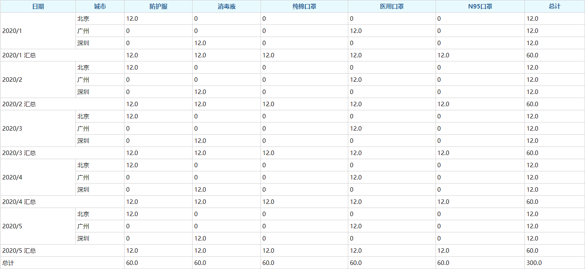

## 树型字典转换

功能说明：

* 多个字段组成树型结构，并按树形结构进行展示。
* 行或列区域都支持树形结构。
* 行或列区域都支持一个树型结构，且需要从首字段开始展示。

需求示例:

city（城市）和prodtype(商品类型）列要求纵向扩展，date（日期）列要求横向扩展，amount（金额）列为交叉数值。

其中城市按大纲布局展示，压缩显示，汇总在顶部。设置树型结构前展示：


| 行标签   | 2020/1 | 2020/2 | 2020/3 | 2020/4 | 2020/5 | 总计 |
| -------- | ------ | ------ | ------ | ------ | ------ | ---- |
| 北京     | 12     | 12     | 12     | 12     | 12     | 60   |
| 防护服   | 12     | 12     | 12     | 12     | 12     | 60   |
| 成都     | 12     | 12     | 12     | 12     | 12     | 60   |
| 纯棉口罩 | 12     | 12     | 12     | 12     | 12     | 60   |
| 广州     | 12     | 12     | 12     | 12     | 12     | 60   |
| 医用口罩 | 12     | 12     | 12     | 12     | 12     | 60   |
| 上海     | 12     | 12     | 12     | 12     | 12     | 60   |
| N95口罩  | 12     | 12     | 12     | 12     | 12     | 60   |
| 深圳     | 12     | 12     | 12     | 12     | 12     | 60   |
| 消毒液   | 12     | 12     | 12     | 12     | 12     | 60   |
| 总计     | 60     | 60     | 60     | 60     | 60     | 300  |

其中city和prodtype的树型结构展示：

```java
public static List<TreeDict> getTreeDict() {
	List<TreeDict> roots = new ArrayList<TreeDict>();
	TreeDict<String, String> root = new TreeDict<String, String>("广州","广州");
	root.addChild("纯棉口罩", "纯棉口罩");
	root.addChild("医用口罩", "医用口罩");
	roots.add(root);
	root = new TreeDict<String, String>("上海","上海");
	root.addChild("N95口罩", "N95口罩");
	root.addChild("医用口罩", "医用口罩");
	roots.add(root);
	root = new TreeDict<String, String>("北京","北京");
	root.addChild("防护服", "防护服");
	root.addChild("N95口罩", "N95口罩");
	roots.add(root);
	root = new TreeDict<String, String>("深圳","深圳");
	root.addChild("消毒液", "消毒液");
	root.addChild("防护服", "防护服");
	roots.add(root);
	return roots;
}
```

示例代码：

```java
List<Map<String, Object>> list = MockDataSource.getList();//获取上述源始数据
Pivot pivot= new Pivot(list);//构建透视对象
privotForge.addRowField("city", "城市");//设置行区域字段(用于纵向扩展）
privotForge.addRowField("prodtype","商品类型");//设置行区域字段（用于纵向扩展)
privotForge.addColField("date","日期");//设置列区域字段（用于横向扩展）
privotForge.addValField("amount","金额");//设置值区域字段（用于显示数值）
privotForge.setLayoutOfToptotal("city", true);//设置城市汇总在顶端。
privotForge.setLayoutOfSameCol("city", true);//设置城市布局压缩显示。
List<TreeDict> treeDict = MockDataSource.getTreeDict();//获取树型结构字典。
privotForge.setTreeDictOfRowPanel(treeDict);//设置行区域的字段为树型结构。
privotForge.exec();//进行数据透视处理
List<List<Map<String, Object>>> tableMap = privotForge.outOfTableMap();//获取透视结果数据
```

outOfTableMap方法返回结果前端展示：


| 城市     | 2020/1 | 2020/2 | 2020/3 | 2020/4 | 2020/5 | 总计  |
| -------- | ------ | ------ | ------ | ------ | ------ | ----- |
| 广州     | 12.0   | 12.0   | 12.0   | 12.0   | 12.0   | 60.0  |
| 纯棉口罩 | 0      | 0      | 0      | 0      | 0      | 0     |
| 医用口罩 | 12.0   | 12.0   | 12.0   | 12.0   | 12.0   | 60.0  |
| 上海     | 12.0   | 12.0   | 12.0   | 12.0   | 12.0   | 60.0  |
| N95口罩  | 12.0   | 12.0   | 12.0   | 12.0   | 12.0   | 60.0  |
| 医用口罩 | 0      | 0      | 0      | 0      | 0      | 0     |
| 北京     | 12.0   | 12.0   | 12.0   | 12.0   | 12.0   | 60.0  |
| 防护服   | 12.0   | 12.0   | 12.0   | 12.0   | 12.0   | 60.0  |
| N95口罩  | 0      | 0      | 0      | 0      | 0      | 0     |
| 深圳     | 12.0   | 12.0   | 12.0   | 12.0   | 12.0   | 60.0  |
| 消毒液   | 12.0   | 12.0   | 12.0   | 12.0   | 12.0   | 60.0  |
| 防护服   | 0      | 0      | 0      | 0      | 0      | 0     |
| 总计     | 60.0   | 60.0   | 60.0   | 60.0   | 60.0   | 300.0 |

## 分类小计-无

**需求示例**

city（城市）和prodtype(商品类型）列要求纵向扩展，date（日期）列要求横向扩展，amount（金额）列为交叉数值，其中城市的小计功能不显示。


| 城市 | 商品类型 | 2020/1 | 2020/2 | 2020/3 | 2020/4 | 2020/5 | 总计 |
| ---- | -------- | ------ | ------ | ------ | ------ | ------ | ---- |
| 北京 | 防护服   | 12     | 12     | 12     | 12     | 12     | 60   |
| 成都 | 纯棉口罩 | 12     | 12     | 12     | 12     | 12     | 60   |
| 广州 | 医用口罩 | 12     | 12     | 12     | 12     | 12     | 60   |
| 上海 | N95口罩  | 12     | 12     | 12     | 12     | 12     | 60   |
| 深圳 | 消毒液   | 12     | 12     | 12     | 12     | 12     | 60   |
| 总计 |          | 60     | 60     | 60     | 60     | 60     | 300  |

示例代码：

```java
List<Map<String, Object>> list = MockDataSource.getList();//获取上述源始数据
Pivot pivot= new Pivot(list);//构建透视对象
privotForge.addRowField("city", "城市");//设置行区域字段(用于纵向扩展）
privotForge.addRowField("prodtype", "商品类型");//设置行区域字段(用于纵向扩展）
privotForge.addColField("date","日期");//设置列区域字段（用于横向扩展)
privotForge.addValField("amount");//设置值区域字段（用于显示数值）
privotForge.setFieldSubtotal("city", Subtotal.NOTHING);//设置城市字段不需要小计。
privotForge.exec();//进行数据透视处理
List<List<Map<String, Object>>> tableMap = privotForge.outOfTableMap();//获取透视结果数据
```

outOfTableMap方法返回结果前端展示：


| 城市 | 商品类型 | 2020/1 | 2020/2 | 2020/3 | 2020/4 | 2020/5 | 总计  |
| ---- | -------- | ------ | ------ | ------ | ------ | ------ | ----- |
| 北京 | 防护服   | 12.0   | 12.0   | 12.0   | 12.0   | 12.0   | 60.0  |
| 深圳 | 消毒液   | 12.0   | 12.0   | 12.0   | 12.0   | 12.0   | 60.0  |
| 成都 | 纯棉口罩 | 12.0   | 12.0   | 12.0   | 12.0   | 12.0   | 60.0  |
| 广州 | 医用口罩 | 12.0   | 12.0   | 12.0   | 12.0   | 12.0   | 60.0  |
| 上海 | N95口罩  | 12.0   | 12.0   | 12.0   | 12.0   | 12.0   | 60.0  |
| 总计 |          | 60.0   | 60.0   | 60.0   | 60.0   | 60.0   | 300.0 |

## 公式计算

功能说明：

* 针对值区域的字段，可使用公式进行计算。
* 公式编写按javaScript写法。

需求示例：

city（城市）列要求纵向扩展，date（日期）列要求横向扩展，值区域字段按 2 *  num * price 设置，并按求和进行汇总。

示例代码：

```java
List<Map<String, Object>> list = MockDataSource.getList();//获取上述源始数据
Pivot pivot= new Pivot(list);//构建透视对象
privotForge.addRowField("city", "城市");//设置行区域字段(用于纵向扩展）
privotForge.addColField("date","日期");//设置列区域字段（用于横向扩展)
privotForge.addValFieldOfFormula("2*num*price","金额",Calculation.SUM);//值区域设置公式
privotForge.setFieldSubtotal("city", Subtotal.NOTHING);//设置城市字段不需要小计。
privotForge.exec();//进行数据透视处理
List<List<Map<String, Object>>> tableMap = privotForge.outOfTableMap();//获取透视结果数据
```

outOfTableMap方法返回结果前端展示：


| 城市 | 商品类型 | 2020/1 | 2020/2 | 2020/3 | 2020/4 | 2020/5 | 总计  |
| ---- | -------- | ------ | ------ | ------ | ------ | ------ | ----- |
| 北京 | 防护服   | 24.0   | 24.0   | 24.0   | 24.0   | 24.0   | 120.0 |
| 深圳 | 消毒液   | 24.0   | 24.0   | 24.0   | 24.0   | 24.0   | 120.0 |
| 成都 | 纯棉口罩 | 24.0   | 24.0   | 24.0   | 24.0   | 24.0   | 120.0 |
| 广州 | 医用口罩 | 24.0   | 24.0   | 24.0   | 24.0   | 24.0   | 120.0 |
| 上海 | N95口罩  | 24.0   | 24.0   | 24.0   | 24.0   | 24.0   | 120.0 |
| 总计 |          | 120.0  | 120.0  | 120.0  | 120.0  | 120.0  | 600.0 |
