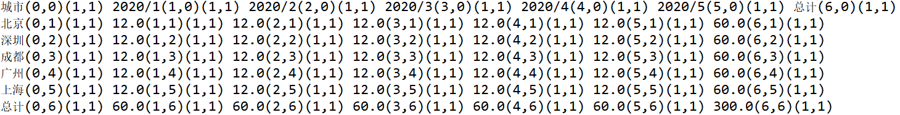
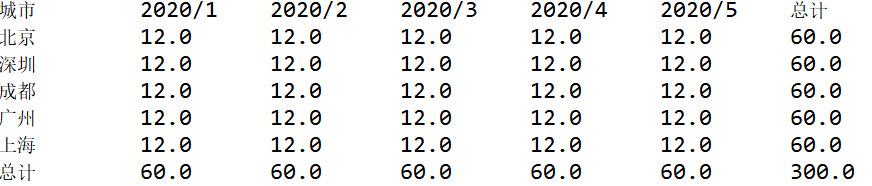

# pivothy使用指南

## 快速入门

[源始数据](docs.json)

示例表格（只展示部分数据）


| date   | amount | city | price | num | saler | prodtype |
| ------ | ------ | ---- | ----- | --- | ----- | -------- |
| 2020/1 | 6      | 北京 | 1     | 6   | 朋友  | 防护服   |
| 2020/1 | 6      | 深圳 | 1     | 6   | 表姐  | 消毒液   |
| 2020/1 | 6      | 成都 | 1     | 6   | 表哥  | 纯棉口罩 |
| 2020/1 | 6      | 广州 | 1     | 6   | 堂姐  | 医用口罩 |
| 2020/1 | 6      | 上海 | 1     | 6   | 堂兄  | N95口罩  |
| 2020/1 | 6      | 北京 | 1     | 6   | 朋友  | 防护服   |
| 2020/1 | 6      | 深圳 | 1     | 6   | 表姐  | 消毒液   |
| 2020/1 | 6      | 成都 | 1     | 6   | 表哥  | 纯棉口罩 |
| 2020/1 | 6      | 广州 | 1     | 6   | 堂姐  | 医用口罩 |
| 2020/1 | 6      | 上海 | 1     | 6   | 堂兄  | N95口罩  |
| 2020/1 | 6      | 深圳 | 1     | 6   | 表姐  | 消毒液   |

示例数据：

```json
{"date":"2020/1","amount":6,"city":"北京","num":6,"saler":"朋友","price":1,"prodtype":"防护服"}
```

示例需求：

date列数据横扩展，city（城市）纵向扩展，amount(金额)为行列交叉的值。

示例代码（java)：

```java
List<Map<String, Object>> list = MockDataSource.getList();//获取上述源始数据
DataSourceMgr<Map<String, Object>> dataSourceMgr = new DataSourceMgr<>(list);//设置数据源
Pivot pivot= new Pivot<Map<String, Object>>(dataSourceMgr);//构建透视对象
privotForge.addRowField("city", "城市");//设置行区域字段(用于纵向扩展）
privotForge.addColField("date");//设置列区域字段（用于横向扩展)
privotForge.addValField("num");//设置值区域字段（用于显示数值）
privotForge.exec();//进行数据透视处理
List<List<Map<String, Object>>> tableMap = privotForge.outOfTableMap();//获取透视结果数据
//上述结果对象Map<String, Object>的属性示例：
//value: 单元格的实际值。
//format: 单元格的格式化后的值。
//posX:单元格所在结果表格的X轴位置。从0开始。
//posY:单元格所在结果表格的Y轴位置。从0开始。
//spancol:单元格所在结果表格的跨列数。
//spanrow:单元格所在结果表格的跨行数。
//dataType:单元格的数据类型，NORMAL("普通"), SUBTOTAL("汇总"), TOTAL("总计"),MUTIL("数值"),TITLE("标题")
List<List<String>> table = privotForge.outOfTable();//获取透视结果数据
//outOfTable方法返回的结果不存在跨行或跨列的情况，输出直接为一个表格。
```

结果数据示例：

outOfTableMap方法返回结果用下列输出方法：

```java
protected void printFormat(List<List<Map<String,Object>>> list) {
		int maxRows = list.size();//最大行
		int maxCols = 0;//最大列
		if(maxRows>0) {
			List<Map<String,Object>> row = (List<Map<String,Object>>)list.get(0);
			if(row!=null &&row.size()>0) {
				Map<String,Object> cell = row.get(row.size()-1);//最后一个单元
				int spancol = StrUtil.getInt(cell, "spancol");
				maxCols = StrUtil.getInt(cell, "posX")+spancol;
			}
		}   	   
		for(int rowIndex=0;rowIndex<maxRows;rowIndex++) {
			List<Map<String,Object>> row = list.get(rowIndex);
			int colIndex=0;
			int cellIndex=0;
			for(;colIndex<maxCols;colIndex++) {
				Map<String,Object> cell = null;
				int posX=0;
				int posY=0;
				if(cellIndex<row.size()) {
					cell = row.get(cellIndex);
					posX = StrUtil.getInt(cell, "posX");
					posY = StrUtil.getInt(cell, "posY");
				}
				if(cell!=null && rowIndex==posY && colIndex==posX) {//坐标对上
					String format = StrUtil.getStrValue(cell, "format");
					getCellDis(cell,format);
					cellIndex++;
				}else {
					String format = "空";
					format+="("+colIndex+","+rowIndex+")";
					format+="(1,1)";
					System.out.print(format+" ");
				}
		
			}
			System.out.println();
		}
	}
```



outOfTable方法返回结果用下列方法输出结果：

```java
public void printTable(List<List<String>> datas) {
		for(List<String> row:datas) {
			for(String cell:row) {
				System.out.format("%-10s", cell);
			}
			System.out.println();
		}
	}
```


